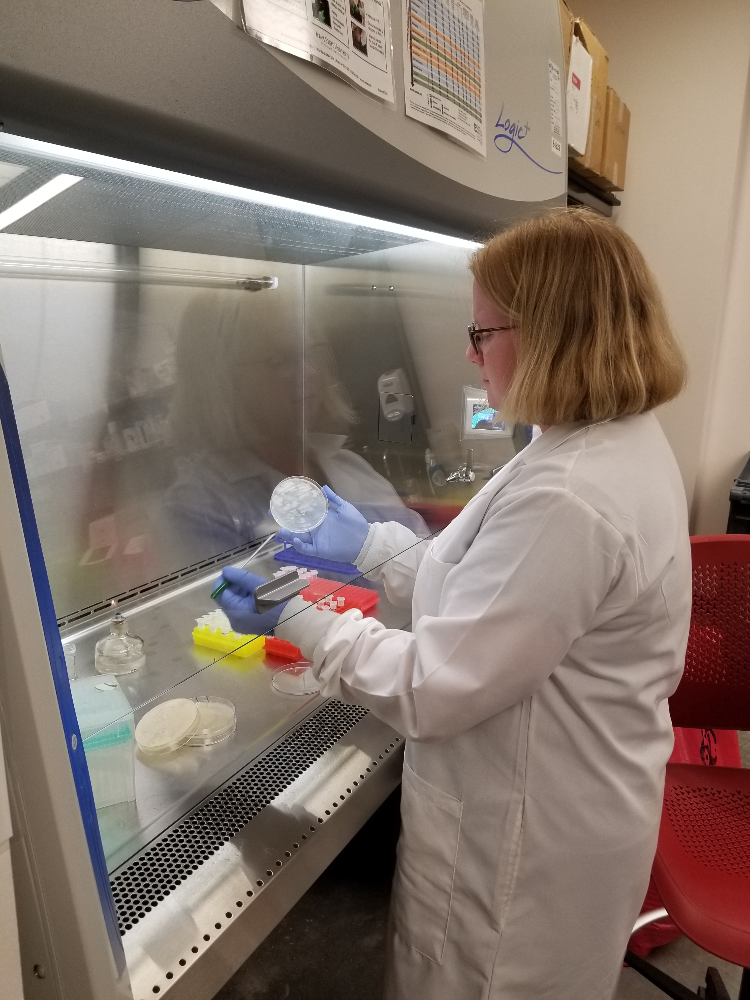

# Grace Carey

I am a PhD student/Graduate Research Assistant who is passionate about improving sustainable agriculture through soil and environmental microbiology.  I have completed a B.S. in environmental horticulture at Virginia Tech, and am pursuing a PhD in the Interdepartmental Microbiology program at Iowa State University.

I am a member of the Genomics and Environmental Research in Microbial Systems Laboratory at Iowa State in the Agricultural and Biosystems Engineering Department under Dr Adina Howe. My research focuses on the transfer of antimicrobial resistance genes from manure associated bacteria to plant rhizosphere and endosphere microbial communities.

